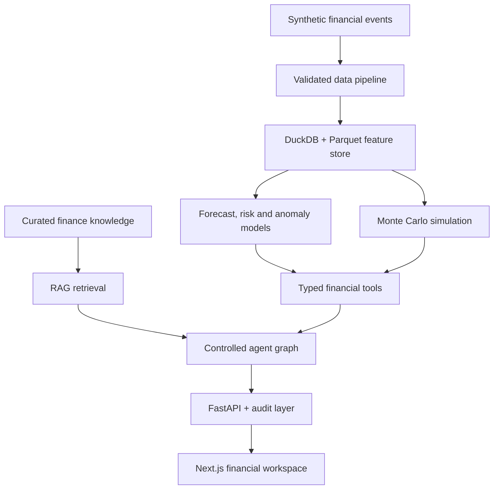
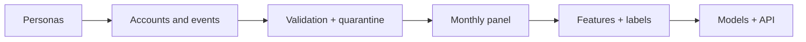

<div align="center">

# FinTwin-X

### An explainable financial twin operating system

**Forecast cash flow. Stress-test decisions. Trace every risk signal. Ask an auditable AI copilot.**


</div>

---

FinTwin-X creates a probabilistic digital twin of a household's finances. It combines a
synthetic transaction ecosystem, a validated feature pipeline, calibrated machine-learning
models, Monte Carlo simulation, explainability and a tool-grounded AI agent in one repository.

It is deliberately built as a **real working surface**, not a landing-page mockup. The web
application exposes cash-flow intelligence, anomaly review, risk drivers, counterfactual actions,
stress tests, goal simulations and model operations against the live FastAPI service.

> **Scope:** FinTwin-X is a research and portfolio system operating on synthetic data. Its
> projections are estimates under stated assumptions—not financial advice or guarantees.

## Why this project exists

Most finance demos stop at a dashboard. Most AI demos let a language model improvise numbers.
FinTwin-X takes a stricter path:

- calculations live in typed Python tools, never in the language model;
- uncertainty is part of every forecast and simulation;
- risk scores are decomposed into human-readable drivers;
- counterfactuals answer “what can change?” rather than only “what is wrong?”;
- the data pipeline is deterministic, validated and time-aware; and
- model health, drift, audit events and tool traces are visible in the product.

## Product workspace

| Module | What it enables |
| --- | --- |
| **Command Center** | Net worth, liquidity, debt, cash flow, health, goals and Financial DNA in one decision surface |
| **Cash Intelligence** | Spending composition, category velocity, merchant concentration and unusual transaction review |
| **Risk Engine** | Calibrated stress probability, SHAP-style drivers, action levers and a 10-scenario adverse matrix |
| **Scenario Lab** | Custom income, expense, inflation, debt and investment assumptions across thousands of futures |
| **AI Copilot** | Natural-language decision support with the exact tools, trace and latency shown beside each answer |
| **Model Operations** | Service topology, model availability, quality metrics, feature drift, agent registry and audit activity |

## Headline example

Ask the copilot:

```text
Can I afford a Rs 4,000,000 car?
```

The agent classifies the request, retrieves the current financial state, simulates the purchase,
compares outcome distributions and explains the decision. It does not calculate the answer in
natural language. The response includes the called tools and execution trace.

The same flow is available directly through the API:

```bash
curl -X POST http://localhost:8000/agent/chat \
  -H "Content-Type: application/json" \
  -d '{"user_id":8,"question":"Can I afford a Rs 4,000,000 car?"}'
```

## Architecture



### Runtime layers

| Layer | Implementation | Responsibility |
| --- | --- | --- |
| Experience | Next.js 15, React 19, TypeScript, Tailwind | Responsive product UI and typed API client |
| Service | FastAPI, Pydantic | Validated analytics, simulation, agent and platform endpoints |
| Agent | Deterministic graph + optional LLM phrasing | Intent routing, tool selection, grounded composition |
| Intelligence | XGBoost/LightGBM, Isolation Forest, SHAP | Forecast, stress risk, anomaly ranking and explanation |
| Simulation | NumPy Monte Carlo engine | Percentile curves, goal probability, stress and optimisation |
| Data | DuckDB, Parquet, optional PostgreSQL/pgvector | Analytical serving, feature marts and vector retrieval |
| Operations | Local model registry, PSI, JSONL audit, Prometheus/Grafana | Evaluation, drift, observability and governance |

More detail: [architecture](docs/architecture.md) · [methodology](docs/methodology.md) ·
[model card](docs/model_card.md) · [threat model](docs/threat_model.md)

## Quick start

The source archive does not include the full generated dataset. Bootstrap the small development
dataset once, then start the API and web app.

### 1. Prepare the backend

```bash
python -m venv .venv
source .venv/bin/activate                 # Windows: .venv\Scripts\activate
python -m pip install -r requirements.txt
cp .env.example .env                      # Windows: copy .env.example .env

make data-small
make pipeline
make train
make rag
```

### 2. Prepare the product UI

```bash
cd apps/web
npm install
cp .env.local.example .env.local          # Windows: copy .env.local.example .env.local
cd ../..
```

### 3. Run both services

Terminal A:

```bash
make api                                   # API: http://localhost:8000
```

Terminal B:

```bash
make web                                   # App: http://localhost:3000
```

Open **http://localhost:3000** for the advanced workspace. API reference is at
**http://localhost:8000/docs**.

For the complete beginner-safe walkthrough, Windows commands, GitHub publishing guide and
troubleshooting, read **[START.md](START.md)**. For the one-link free public deployment, use
**[DEPLOY_FREE.md](DEPLOY_FREE.md)**.

## Docker stack

The Docker image now builds a compact synthetic dataset, models, RAG index and the exported web UI itself.

```bash
cp .env.example .env
python -c "import secrets; print(secrets.token_urlsafe(48))"
# paste the output into FINTWIN_JWT_SECRET in .env
docker compose up --build
```

| Service | Address |
| --- | --- |
| FinTwin workspace | http://localhost:3000 |
| FastAPI / OpenAPI | http://localhost:8000/docs |
| MLflow | http://localhost:5000 |
| Prometheus | http://localhost:9090 |
| Grafana | http://localhost:3001 |

The containers run as non-root users. Production mode refuses known development JWT secrets,
disables the bundled demo user by default and restricts CORS to configured origins.

## Intelligence engines

### Forecasting

- direct 1, 3, 6 and 12-month income and expense forecasts;
- separate models for income and expenses, with net cash flow derived compositionally;
- 90% conformal prediction intervals from held-out residuals; and
- seasonal-naive benchmarks stored with model evaluation results.

### FinTwin Risk Score

- calibrated 0–100 probability of financial stress within six months;
- leakage-safe temporal labels using a six-month future window;
- liquidity, debt, income, spending, savings, emergency and goal sub-scores;
- SHAP-style contribution points; and
- financially consistent counterfactual actions that re-derive dependent features.

### Anomaly detection

- Isolation Forest signal;
- robust median-absolute-deviation score;
- transaction-to-month ratio;
- burst behaviour and merchant rarity; and
- rank-fused anomaly severity with category-level alerts.

### Simulation

- thousands of monthly paths from a deterministic random seed;
- income shocks, recovery, inflation, one-off expenses, debt and investing;
- p5, p50 and p95 liquidity and net-worth curves;
- goal success, stress probability and months-of-cover outputs; and
- comparison and optimisation endpoints.

## Data system

The generator creates coherent financial lives rather than independent random tables. Eight
personas drive income regularity, category spending, debt, investment behaviour, shocks and goal
patterns. Downstream transformations produce a monthly analytical panel and 71 serving features.



Use `make data-small` for development. Use `make data` to generate the full 10,000-user,
24-month research population.

## API surface

| Area | Representative endpoints |
| --- | --- |
| Platform | `GET /health`, `/metrics`, `/monitoring/drift`, `/audit`, `/tools` |
| Profiles | `GET /users`, `/users/{id}/overview`, `/dna`, `/cashflow` |
| Intelligence | `GET /users/{id}/spending`, `/forecast`, `/anomalies` |
| Risk | `GET /users/{id}/risk`, `/risk/explain`, `/risk/counterfactuals`, `/stress-test` |
| Simulation | `GET /scenarios/presets`, `POST /simulate`, `/simulate/compare`, `/simulate/optimise` |
| Agent + RAG | `POST /agent/chat`, `/rag/search`, `/rag/ask` |
| Identity | `POST /auth/register`, `/auth/login`, `GET /auth/me` |

See [docs/api.md](docs/api.md) for request and response examples.

## Repository map

```text
fintwin-x/
├── apps/
│   ├── api/                 FastAPI routes, security and service layer
│   └── web/                 Advanced Next.js financial workspace
├── agents/                  Tool registry, routing graph and grounded copilot
├── common/                  Configuration, storage, audit and shared utilities
├── data_generator/          Synthetic financial ecosystem
├── database/                PostgreSQL and pgvector schemas
├── docs/                    Architecture, methodology, API and governance docs
├── infrastructure/          Prometheus and Grafana configuration
├── ml/                      Forecasting, risk, anomaly, explainability and drift
├── pipelines/               Ingestion, validation, transforms, features and labels
├── rag/                     Curated knowledge and retrieval pipeline
├── simulation/              Monte Carlo, stress, goal and optimisation engines
├── tests/                   Data, model, simulation, agent and API checks
├── docker-compose.yml       Five-service local platform
├── START.md                 Zero-to-running and GitHub guide
└── README.md                Project overview
```

## Configuration

Copy `.env.example` to `.env` and keep `.env` out of Git.

| Variable | Development default | Purpose |
| --- | --- | --- |
| `FINTWIN_ENV` | `dev` | Runtime environment |
| `FINTWIN_JWT_SECRET` | insecure local placeholder | JWT signing secret; production must replace it |
| `FINTWIN_CORS_ORIGINS` | local web origins | Comma-separated allowed browser origins |
| `FINTWIN_ENABLE_DEMO_USER` | `true` | Seed the synthetic demo account; disabled by Docker production default |
| `FINTWIN_RANDOM_SEED` | `42` | Deterministic generation, training and simulation |
| `DATABASE_URL` | empty | Optional PostgreSQL serving store |
| `LLM_API_KEY` | empty | Optional natural-language phrasing; calculations remain tool-owned |
| `FINTWIN_EMBEDDING_BACKEND` | `tfidf` | `tfidf`, `openai` or `sentence-transformers` |
| `MLFLOW_TRACKING_URI` | empty | Optional experiment tracking server |

## Security and trust boundaries

- PBKDF2-HMAC-SHA256 password hashing with unique salts;
- signed JWT access tokens with issuer and expiry claims;
- per-IP sliding-window rate limiting;
- explicit CORS allowlist and browser security headers;
- production startup rejection for known development secrets;
- production demo-account opt-out by default;
- Pydantic validation on request bodies;
- pseudonymous synthetic users with no CNICs, real emails or bank credentials;
- safe UI rendering of agent output without raw HTML injection; and
- append-only JSONL activity records with request IDs and timings.

This repository is not a turnkey banking system. Redis-backed rate limits, managed secrets,
central identity, encrypted durable storage, formal privacy controls and an external security
review are still required before any real-data deployment. See [SECURITY.md](SECURITY.md) and
[docs/threat_model.md](docs/threat_model.md).

## Verification

```bash
make test                                  # backend and model checks
make lint                                  # blocking Python correctness checks
make web-build                             # TypeScript check + production UI build
make check                                 # backend tests + frontend build
```

GitHub Actions repeats the Python pipeline on Python 3.11 and 3.12, uploads model metrics and
builds the Next.js application on Node 20.

## Documentation

| Document | Purpose |
| --- | --- |
| [START.md](START.md) | Installation, run order, demo flow, GitHub publishing and troubleshooting |
| [Architecture](docs/architecture.md) | Components, data flow and scale-up path |
| [Methodology](docs/methodology.md) | Personas, labels, features, models and caveats |
| [Model card](docs/model_card.md) | Metrics, intended use, fairness and failure modes |
| [Data dictionary](docs/data_dictionary.md) | Raw fields, marts and serving tables |
| [API reference](docs/api.md) | Endpoints and examples |
| [Threat model](docs/threat_model.md) | Assets, threats, mitigations and deployment checklist |
| [Contributing](CONTRIBUTING.md) | Branch, quality and pull-request workflow |

## Roadmap

- [ ] Open Banking sandbox connectors behind an explicit consent layer
- [ ] Redis-backed distributed rate limiting and job orchestration
- [ ] OIDC/SAML identity and tenant-level policy enforcement
- [ ] Event-driven model scoring and feature freshness SLAs
- [ ] Model approval workflow and signed artifact provenance
- [ ] Localisation and multi-currency simulation
- [ ] Kubernetes and managed-cloud deployment blueprints

These are roadmap items, not features claimed by the current repository.

## License

MIT — see [LICENSE](LICENSE).

---

<div align="center">
Built to demonstrate the full decision-intelligence chain: data → features → models → simulation → agents → product → operations.
</div>
